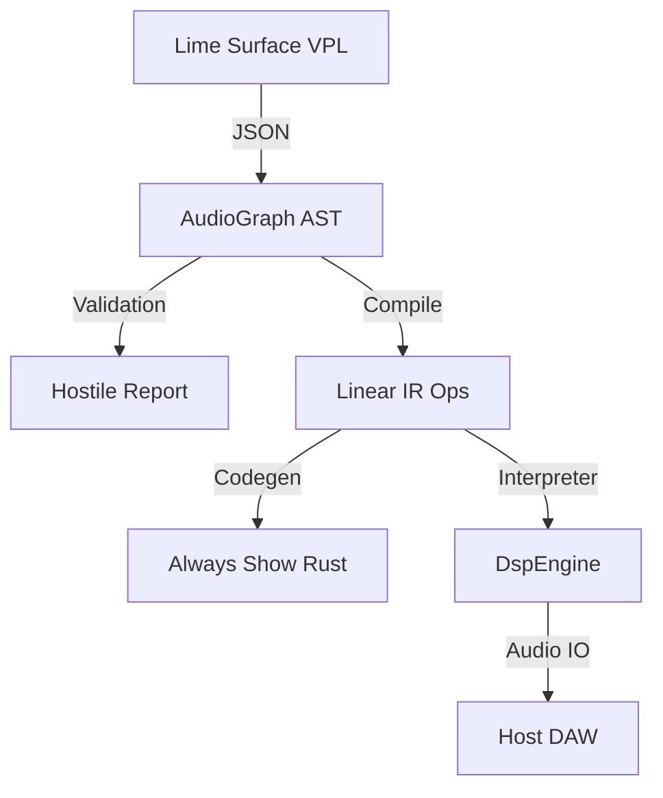

# LimeStudio: The Visible Compiler for Audio Logic

> "Confidence is the product. Visual clarity is the weapon."

LimeStudio is a high-performance audio framework designed for musicians and developers who demand professional-grade reliability, transparency, and "Trust UI" in their signal processing chains.

---

## 1. Mission Statement
**"A trust-first audio framework where musicians build products, not toys."**

LimeStudio transforms the "Visual Programming Language" from a decorative interface into a **Visible Compiler**. Every connection, every knob, and every line of code is designed to eliminate ambiguity and provide absolute confidence in real-time safety.

---

## 2. The Core Pillars

### 2.1 Trust UI (Operational Clarity)
We don't build "pretty" knobs. We build **Trust UI**.
- **Modulation Rings**: Visualizing exactly how parameters are being influenced in real-time.
- **Safety Monitors**: Instant visibility into latency, denormals, and math instability.
- **Provenance Trace**: Tracking exactly why a parameter value is what it is (Macro -> LFO -> Velocity).

### 2.2 Lime Surface (Physics-First UI Runtime)
A custom `wgpu` + `SDF` rendering engine designed specifically for audio software.
- **Forbidden Linear Lerp**: All UI transitions use **Critically Damped Springs** for inertia and resistance.
- **Mandatory Oklab**: All color interpolation occurs in Oklab space for perceptual consistency.
- **SDF Rendering**: Perfect anti-aliasing for knobs, cables, and meters with zero-cost scaling.

### 2.3 Hostile Validation (Real-Time Safety)
Plugin development is a war against "Hostile Environments". LimeStudio includes automated validation for:
- **Denormal Prevention**: Automatic flushing of subnormal numbers.
- **NaN/Inf Propagation**: Detecting and isolating math errors before they hit your speakers.
- **Stack Safety**: Verifying DSP logic size before it ever runs on the audio thread.

---

## 3. Architecture: The 3-Rate System

LimeStudio separates processing into three distinct rates to compete with flagship pro-grade synths:

1.  **Audio Rate (a-rate)**: Full 44.1kHz+ sample-accurate processing.
2.  **Control Rate (k-rate)**: High-speed modulation and filter updates (typically 1/64 of a-rate).
3.  **Event Rate (e-rate)**: Asynchronous trigger and MIDI event handling.



---

## 4. Components

- **`limestudio_core`**: The heart. Preset migration, 3-rate ParamGraph, and the Live Compiler.
- **`limestudio_surface`**: The face. Custom UI runtime with spring physics and SDF rendering.
- **`limestudio_cli`**: The toolset. Offline rendering, benchmarking, and automated Rust code export.
- **`limestudio_dsp`**: The muscle. Optimized SIMD-ready DSP primitives.

---

## 5. Productization Features (Tier S - Tier Ω)

| Tier | Feature | Description |
|---|---|---|
| **S** | **Preset System** | Versioned migration (v0 -> v1) and A/B comparison. |
| **S** | **Trust UI** | Modulation rings, provenance badges, and safety monitors. |
| **S+** | **Live Compiler** | Zero-latency safe IR swapping while audio is running. |
| **A** | **Always Show Rust** | Real-time conversion of visual logic to readable Rust code. |
| **B** | **ParamGraph** | Automatic rate escalation (Event -> Control -> Audio). |
| **Ω** | **Graph Diff** | Semantic comparison of patches to see "what changed". |

---

## 6. Getting Started

### CLI Power Tools
Validate your logic before hitting the DAW:
```bash
# Performance benchmark
limestudio bench my_patch.lime --block-size 512

# Export to professional Rust code
limestudio codegen my_patch.lime --output MyPlugin.rs

# Offline deterministic render
limestudio render my_patch.lime --duration 5.0
```

---

## 7. License
MIT - Transparent Logic. Professional Sound.
